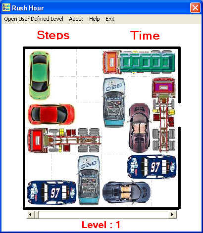



## Rush Hour

### Description

Rush Hour is a logical game ... a nice ones, that's all !!!

The purpose of the game is to bring out the Red CAR,

You are able to move each CAR in straight line.

The game has 40 standard levels. You may define your own levels too!

I've included several levels like 2.txt and so on, you can compare

2.txt file with level 2 to understand how you are able to define

"User Defined Levels" ... Enjoy

Mahdi Shakouri Rad  Mahdi.ShakouriRad@gmail.com Mahdi_Rad@yahoo.com
 
### More Info
 

             |
---                |---
**Submitted On**   |2005-05-23 16:00:12
**By**             |[Mahdi Shakouri Rad](https://github.com/Planet-Source-Code/PSCIndex/blob/master/ByAuthor/mahdi-shakouri-rad.md)
**Level**          |Beginner
**User Rating**    |5.0 (70 globes from 14 users)
**Compatibility**  |VB 6\.0
**Category**       |[Games](https://github.com/Planet-Source-Code/PSCIndex/blob/master/ByCategory/games__1-38.md)
**World**          |[Visual Basic](https://github.com/Planet-Source-Code/PSCIndex/blob/master/ByWorld/visual-basic.md)
**Archive File**   |[Rush\_Hour189834672005\.zip](https://github.com/Planet-Source-Code/mahdi-shakouri-rad-rush-hour__1-60979/archive/master.zip)

